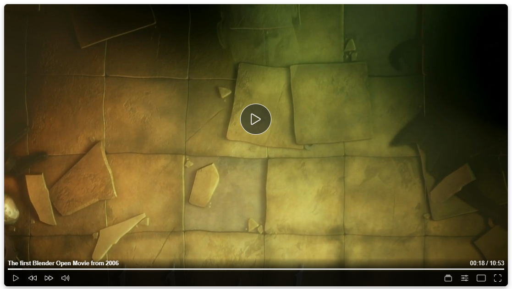

---

# Custom HTML5 Video Player



This project features a custom video player built using plain JavaScript. It includes various functionalities such as play/pause control, volume adjustment, playback speed settings, fullscreen toggle, and more.

---

### Features

- Responsive design for various screen sizes.
- Support for various video formats.
- Touch and click navigation support.
- Keyboard Shortcut Key Support
- Customizable player controls.
- Play/Pause Control, Volume Control, Playback Controls, Fullscreen Mode, Playback Speed Adjustment, Video Navigation, Mini Player and Theater Mode, Loading Indicator.

---

## Keyboard Shortcuts

This custom video player supports the following keyboard shortcuts to enhance your video playback experience:

| **Shortcut Key** | **Action**               | **Description**                                  |
|------------------|--------------------------|--------------------------------------------------|
| `f`              | Toggle Fullscreen        | Enter or exit fullscreen mode.                  |
| `→` (Right Arrow) | Forward                   | Skip the video forward.                         |
| `←` (Left Arrow)  | Backward                  | Rewind the video.                               |
| `t`              | Toggle Theater Mode      | Switch between normal and theater modes.        |
| `i`              | Toggle Mini Player       | Activate or deactivate mini player view.        |
| `m`              | Toggle Mute/Unmute       | Mute or unmute the video.                       |
| `+`              | Increase Playback Speed  | Increase the playback speed.                    |
| `-`              | Decrease Playback Speed  | Decrease the playback speed.                    |

### Links

[](https://nexoscreator.github.io/html5-custom-video-player)
[](https://github.com/nexoscreator/html5-custom-video-player)
[](https://youtu.be/rMnDe0iEGRs?si=B2viVesOhHYusbBG)

---

### Installation

Provide step-by-step instructions on how to install and set up your project.

1. **Include the Video Player in HTML**

   Use the following HTML to include the video player in your page:

   ```html
   <div class="nexos-video-player" data-src="path/to/your/video.mp4" data-title="Video Title"></div>
   ```

2. **Link CSS Styles**

   Include the necessary CSS to style the video player and controls.
   
   ```html
   <link rel="stylesheet" href="https://cdn.jsdelivr.net/gh/nexoscreator/html5-custom-video-player@v0.0.3/video-player.min.css">
   ```

3. **Link the JavaScript**

   Add the JavaScript code cdn link provided below to the functionality of the video player.
   
   ```html
   <script src="https://cdn.jsdelivr.net/gh/nexoscreator/html5-custom-video-player@v0.0.3/video-player.min.js" defer></script>
   ```

---

### Customization

Customize the player by modifying the CSS styles in styles.css and the JavaScript in player.js.

1. **Clone the Repository:**
   ```bash
   git clone https://github.com/nexoscreator/html5-custom-video-player.git
   cd html5-custom-video-player
   ```

2. **Customize CSS:**
Customize the player styles by modifying the `video-player.css` file.

3.  **Customize JavaScript:**
Adjust player functionality by editing the `video-player.js` file. You can update controls, navigation, or error handling as needed.

---

### Contributing
Contributions are welcome! If you have any suggestions, bug fixes, or improvements, feel free to open an issue or submit a pull request.
If you'd like to contribute to this project, please follow these ste

1. Fork the repository.
2. Create a new branch (`git checkout -b feature/improvement`).
3. Make your changes and commit them (`git commit -m 'Add feature/improvement'`).
4. Push to the branch (`git push origin feature/improvement`).
5. Open a Pull Request.

Please check the [CONTRIBUTING.md](CONTRIBUTING.md) file for more details.

---

### License

This project is licensed under the [MIT License](LICENSE).